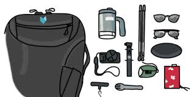

# Local Search Method for Knapsack Problem

<p>
    
</p>

### Problem Description

Given a set of items, each with a weight and a value, determine the number of each item to include in a collection so that the total weight is less than or equal to given limit and the total value is as large as possible.

* _input_
```
values = [20, 5, 10, 40, 15, 25];
weights = [1, 2, 3, 8, 7, 4];
target = 10;
```
* _output_
```
60 (1 (20) + 8 (40) = 9 < 10)
```

